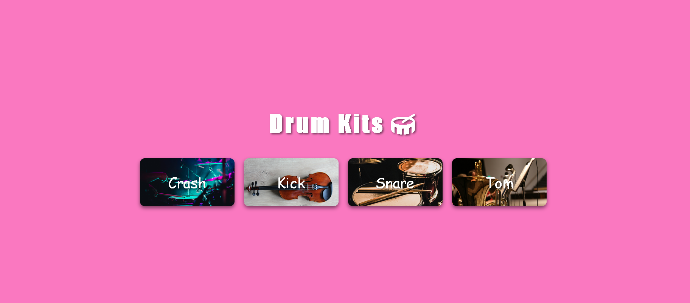

# 🥁 Drum Kits

A fun and interactive drum kit web app built using HTML, CSS, and JavaScript.

## 🧩 How it works

Click on any button or press the matching keyboard key to hear the sound of a musical instrument. Each button is linked to a different drum sound (like snare, kick, crash, etc.).

For example:  
👉 Clicking on the **C** button plays the **Crash** sound.

👉 Clicking on the **K** button plays the **Kick** sound.

👉 Clicking on the **S** button plays the **Snare** sound.

👉 Clicking on the **T** button plays the **Tom** sound.

## 📸 Screenshot

