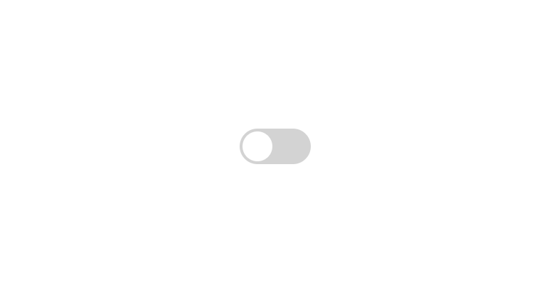

# 🌙 Dark Mode Toggle

A simple web project to toggle between **Light Mode** and **Dark Mode** using HTML, CSS, and JavaScript.

## 🧩 How it works

Click the toggle button to switch the theme of the website from light to dark mode and vice versa.  
It's a smooth way to enhance user experience and reduce eye strain!

## 📸 Screenshots

### Before clicking on the Button

### After clicking on the Button

