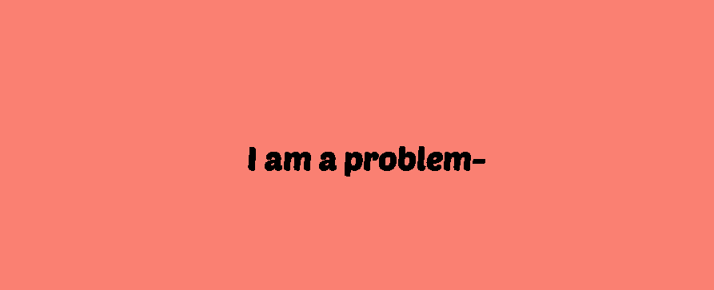
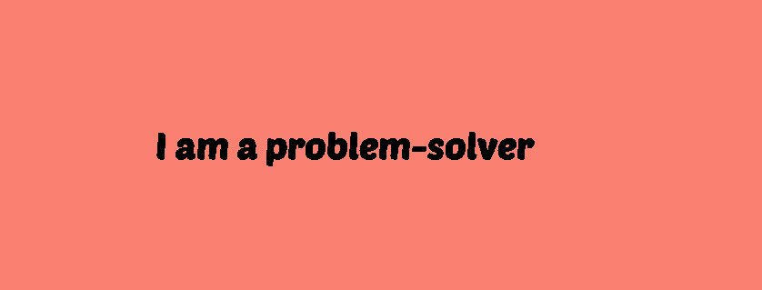

# ✨ Auto Text Effect Animation

A creative text animation project built with HTML, CSS, and JavaScript that gives a typing effect to any text content.

## 🧩 How it works

This project automatically types out text letter by letter, simulating a typing animation. Once the full text appears, it starts over — creating a smooth, looping effect. You can easily customize the speed and text content.

## 📸 Screenshots

